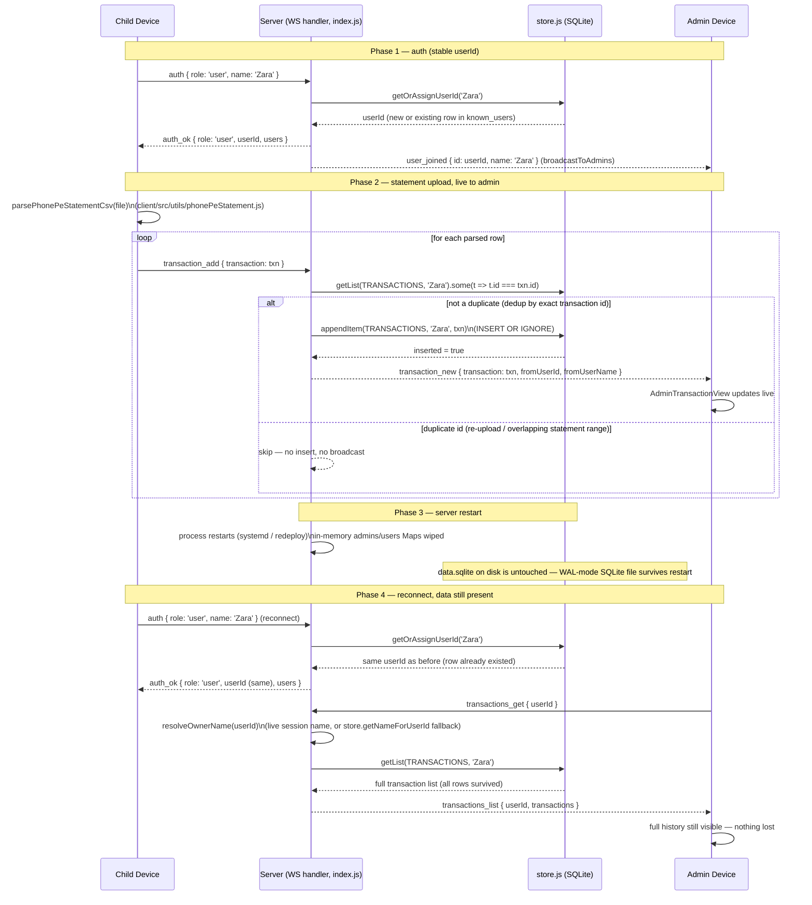

# FamilyWatch — Architecture Diagrams (source material)

Draft source material for a polished architecture diagram. Verified against
the code as of 2026-08-14 (branch `feature/admin-home-calllog-browsing-v2`),
using `docs/project-overview.md` as a starting point. See "Discrepancies vs.
project-overview.md" at the bottom for the few places the code disagreed with
that doc.

---

## 1. End-to-end system diagram

```mermaid
flowchart TD
    subgraph ChildDevice["Family Member's Phone (Native Android App)"]
        direction TB
        WebView["MainActivity\n(WebView host + MeeeeNative JS bridge)"]
        BundledUI["Bundled React UI\n(client/dist, loaded from local assets)"]
        KAS["KeepAliveService\n(foreground service)"]
        AccessSvc["BrowserActivityAccessibilityService\n(Chrome address-bar reader)"]
        Boot["BootReceiver / ServiceRestartWorker"]
        LKMgr["LiveKitManager\n(camera publish)"]

        WebView --> BundledUI
        Boot -->|starts on boot / restarts if killed| KAS
        AccessSvc -->|"in-process call: sendBrowsingEvent()"| KAS
        KAS --> LKMgr
    end

    subgraph AdminDevice["Admin/Parent Device (same app, admin role)"]
        AdminUI["Bundled React UI (admin role)\nHomeScreen, AdminPanel, AdminTransactionView,\nAdminBrowsingView, AdminCallLogView,\nLiveMonitorPanel, ScreenshotsPanel"]
    end

    subgraph ClientFeatures["client/src/ feature areas (both devices)"]
        Chat["Chat / DM\n(ChatWindow, MessageList, AdminPanel/UserPanel)"]
        Finance["Transactions\n(TransactionPanel: manual entry +\nPhonePe CSV statement upload)"]
        Islamic["Namaz / Quran / Duas / Hadees\n(NamazTracker, DuasPage)"]
        Monitoring["Admin monitoring\n(call log, browsing, screenshots,\nlive camera/mic/location, file browser)"]
    end

    BundledUI -.-> ClientFeatures
    AdminUI -.-> ClientFeatures

    subgraph ExternalAPIs["External content APIs (called directly from client)"]
        AlQuran["Al Quran Cloud API\n(api.alquran.cloud)\nsurah list, ayahs, translations, search"]
        HadithCDN["Hadith CDN\n(jsdelivr, fawazahmed0/hadith-api)"]
    end

    Islamic -->|"fetch: surah/ayah/translation/search JSON"| AlQuran
    Islamic -->|"fetch: hadith editions JSON"| HadithCDN

    subgraph VM["GCE e2-micro VM — familywatch-server-2 (us-west1-b)"]
        direction TB
        Nginx["nginx\n(TLS via Certbot/Let's Encrypt,\npath-based routing)"]

        subgraph NodeApp["Node process — server/index.js (:8080, systemd)"]
            direction TB
            WSHub["WebSocket hub (/ws)\nauth, routing, dedup"]
            HTTPEp["HTTP endpoints:\nstatic client/dist, /api/version,\n/api/app-download, /api/screenshot(s)/:id,\n/api/file/:id, /api/lk-token,\n/api/quran-indopak (proxy)"]
            Store["server/store.js\n(better-sqlite3, data.sqlite)\ntransactions, browsing_history,\ncall_logs, known_users"]
            InMemMaps["In-memory only (no DB):\nscreenshots (24h TTL, AES-256-GCM),\nfile transfers (10min TTL)"]
        end

        LiveKit["LiveKit SFU\n(Docker container, :7880)\ncamera/mic AV signaling+media"]
        Backup["server/backup.js\n(systemd timer, nightly ~02:37)"]

        Nginx -->|"/ -> :8080"| NodeApp
        Nginx -->|"/livekit/ -> :7880"| LiveKit
        WSHub --> Store
        WSHub --> InMemMaps
        Backup -->|"reads snapshot via\nbetter-sqlite3 backup API"| Store
    end

    KAS <-->|"WSS wss://familywatch.duckdns.org/ws\nauth (name+__bg__), transaction_add,\nbrowsing_add, call_log_add,\nscreenshot POST, camera_frame,\naudio_chunk, location_update"| Nginx
    WebView <-.->|"WSS /ws\nauth (name), transaction_add,\ntext/dm chat"| Nginx
    AdminUI <-->|"WSS /ws\nauth (PIN), transactions_get,\nbrowsing_get, call_log_get,\nstart_camera/mic/location, ls/read_file"| Nginx

    LKMgr -.->|"camera publish\n(WebRTC via LiveKit token)"| LiveKit
    AdminUI -.->|"camera subscribe\n(WebRTC via LiveKit token)"| LiveKit

    subgraph DNSInfra["Dynamic DNS"]
        DuckDNS["DuckDNS\nfamilywatch.duckdns.org -> VM ephemeral external IP"]
    end
    DuckDNS -.->|"resolves hostname\n(updated on IP change)"| VM

    subgraph ExtServices["External Services"]
        GitHub["GitHub\n(source, Releases, Actions CI/CD)"]
        GCS["Google Cloud Storage\nbucket familywatch-backups-7f266f68"]
        Metadata["GCE metadata server\n(service-account token for VM)"]
    end

    HTTPEp -->|"GET latest release + APK asset\n(GITHUB_TOKEN, private repo)"| GitHub
    Backup -->|"HTTPS upload\n(bearer token)"| GCS
    Backup -->|"fetch access token"| Metadata

    subgraph CICD["CI/CD Pipeline (GitHub Actions)"]
        direction LR
        Trigger["push to main /\nworkflow_dispatch"]
        BuildAPK["Build + sign release APK\n(Gradle, release keystore secrets)"]
        Release["Publish GitHub Release\n(tag latest-build)"]
        DeploySSH["SSH deploy step\n(appleboy/ssh-action, DEPLOY_SSH_KEY)\ngit reset --hard, npm install,\nclient build, systemctl restart"]
        BackupTimer["Install/enable nightly\nbackup systemd timer\n(continue-on-error)"]

        Trigger --> BuildAPK --> Release --> DeploySSH --> BackupTimer
    end

    CICD -->|"git push triggers"| GitHub
    DeploySSH -->|"ssh fatemasayed760@familywatch.duckdns.org"| VM
    Release -->|"GET /api/app-download proxies\nAPK bytes to in-app updater"| HTTPEp
```

---

## 2. Sequence diagram — statement upload survives a server restart

---

## 3. Legend / notes

- The WebView on both the child's and admin's native app loads the bundled
  React app (`client/dist`) from local app assets — confirmed via
  `client/capacitor.config.json` having no `server.url` key. The **only**
  network hop from the native app is the WebSocket connection (and a handful
  of plain HTTPS calls) to `familywatch.duckdns.org`; the UI itself never
  loads over the network.
- Screenshots and ad-hoc file transfers are intentionally **not** persisted
  to SQLite. They live only in in-memory `Map`s on the Node process
  (`screenshotStore`/`screenshotIndex`, `fileStore`) with short TTLs (24h for
  screenshots, 10min for files) and are encrypted at rest (AES-256-GCM) while
  they exist. This is deliberately out of scope of the SQLite durability
  work — a server restart during that TTL window loses them, by design.
- The removed notification-listener / SMS-capture transaction path no longer
  exists in the tree (`TransactionNotificationListener.kt`,
  `SmsTransactionParser.kt`, `BankSmsReceiver.kt` were all deleted in
  `9cb2abc`). Manual entry + PhonePe CSV statement upload
  (`phonePeStatement.js`) is the only transaction-capture path today.
- `KeepAliveService` runs a second, background-only WebSocket session
  authenticated with the display name plus a `__bg__` suffix; the server
  links it to the same visible user (and the same `userId`) as the
  foreground WebView session rather than showing it as a separate user —
  this is why `transaction_add`/`browsing_add`/`call_log_add` sent from the
  native background service still land under the right person.
- Browsing capture is in-process, not cross-service IPC:
  `BrowserActivityAccessibilityService` (which reads Chrome's address bar
  node) calls `KeepAliveService.sendBrowsingEvent(...)` directly as a static
  method inside the same app process; `KeepAliveService` is what actually
  owns the WebSocket and sends `browsing_add`.
- Quran content is split across two paths, not one: the default script
  (Uthmani), translations, transliteration, audio references, surah list,
  and search all call the **Al Quran Cloud API** (`api.alquran.cloud`)
  directly from the client, with no server involvement. The optional
  **Indo-Pak script mode**, however, is proxied through the server
  (`GET /api/quran-indopak`) to a *different* provider (Quran Foundation's
  OAuth2-gated API) — that one can't be called directly from client JS
  because it requires a client secret, which the server keeps server-side
  and exchanges for a cached access token. Hadith text comes from a third,
  separate source (a public jsDelivr-hosted JSON CDN), also fetched directly
  from the client.
- Nightly backup is a separate, independent path out of the same VM: it
  reads a live-safe snapshot of `data.sqlite` (via `better-sqlite3`'s own
  online-backup API, never a raw file copy) and uploads it straight to a GCS
  bucket using a bearer token obtained from the GCE instance metadata server
  — no `gsutil`/Cloud SDK and no separate service-account key. This is
  insurance against disk loss/corruption, which is a different failure mode
  than the ordinary restarts that on-disk SQLite already survives on its
  own.
- The deploy pipeline uses `git reset --hard`, not a plain `git pull`, when
  SSHing into the VM — worth knowing if anyone expects uncommitted VM-local
  changes to survive a deploy (they won't).
- DuckDNS is a dynamic-DNS layer, not a load balancer or proxy in the
  traffic path: it just keeps `familywatch.duckdns.org` pointed at whatever
  the VM's ephemeral external IP currently is, since the VM has no static
  IP. Once resolved, the browser/app talks straight to the VM.

---

## Discrepancies vs. `docs/project-overview.md`

- **Quran API is not purely client-direct.** The doc's Section 1 states
  Quran features call an external API directly from the client with no
  server involvement. That's true for the *default* (Uthmani) script and
  everything else (translations, search, surah list, hadith), but the
  **Indo-Pak script toggle** in `DuasPage.jsx` calls a server-side proxy
  endpoint, `GET /api/quran-indopak` (`server/index.js`), which itself talks
  to a *different* external provider — the Quran Foundation's OAuth2-gated
  API (`apis.quran.foundation` / `prelive-oauth2.quran.foundation`), using
  `QURAN_FOUNDATION_CLIENT_ID`/`QURAN_FOUNDATION_CLIENT_SECRET` env vars —
  not mentioned anywhere in `project-overview.md`. This looks like real,
  working, but undocumented functionality (there's also an `undici`
  `ProxyAgent` setup in `server/index.js` specifically commented as being
  for "outbound fetch() calls ... to Quran Foundation").
- **Stale in-code comments reference a `DnsMonitorVpnService` that doesn't
  exist.** `server/index.js`'s comments on the `browsing_add` handler say
  "captured by the native DNS monitor" and "`DnsMonitorVpnService` talks to
  the server via KeepAliveService's background socket" — but no such file
  exists anywhere in the repo. The actual capture mechanism (confirmed in
  code) is `BrowserActivityAccessibilityService.kt` reading Chrome's
  address-bar `AccessibilityService` node, exactly as `project-overview.md`
  correctly describes elsewhere. This is a stale/copy-pasted code comment,
  not a doc error, but it's worth flagging since it could mislead someone
  reading `server/index.js` directly.
- Everything else checked (WS message names, `store.js`/`backup.js`
  mechanics, nginx/LiveKit/VM topology, CI/CD steps, native Android service
  responsibilities, capacitor bundling) matched `project-overview.md`
  accurately.
